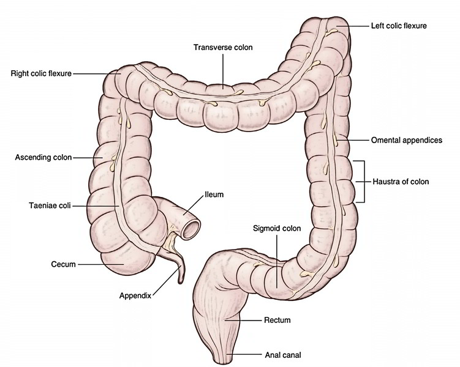
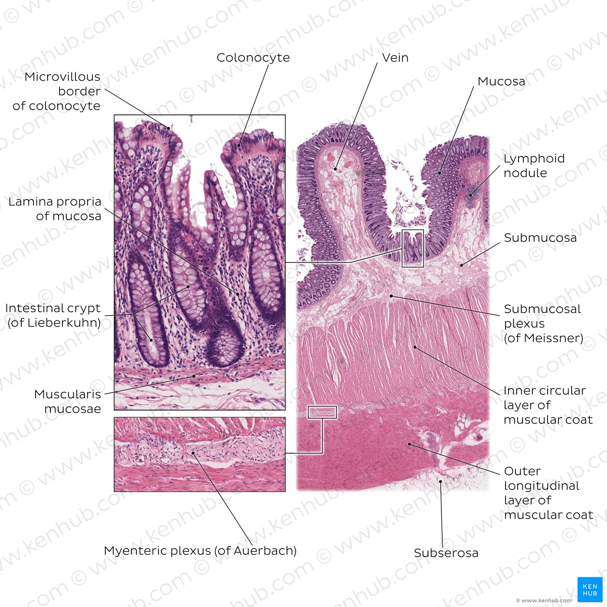
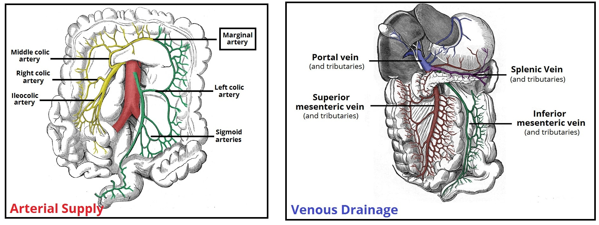
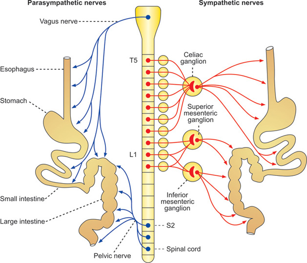
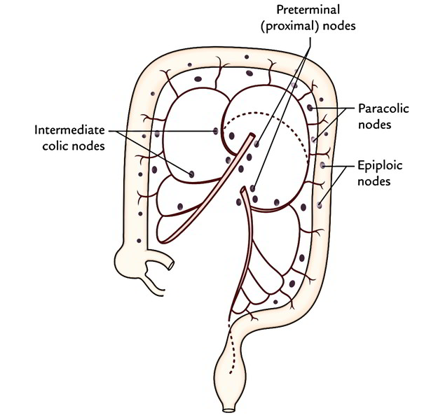

# Colon:
- It's the *longest part of the large intestine* approximately *1.5 meters* (5 feet) long and plays a vital role in the digestive system.
- Also known as Large intestine, is the final part of digestive system.
- It is responsible for *absorbing water and nutrients from digested food material* and forming stool. The colon hosts a large population of microorganisms that aid digestion and &produce essential vitamins like vitamin K and some B vitamins* which are absorbed into the bloodstream.
- It extends from the *ileocecal junction* (where the small intestine ends) to the *rectum*
  
## Development of the Colon
- After fertilization a *zygote* is formed. By *3–4 days* it becomes a *morula* and by *5–6 days* a *blastocyst* develops.
- The blastocyst has two layers:
    - *Outer cell mass (trophoblast)* : It's developed into the *placenta*.
    - *Inner cell mass* : It forms the *embryo*.
- During the *third week* *gastrulation* occurs.
  - It forms *three germ layers*:
    - *Ectoderm* forms nervous system, skin.
    - *Mesoderm* forms muscles, connective tissue.
    - *Endoderm* forms epithelial lining of the gut.
- By *week 4* the *primitive gut tube* forms and dividing into *foregut, midgut, and hindgut*.
    - *Colon** arises from Midgut and Hindgut.
    - *Midgut* forms ascending colon, proximal two-thirds of transverse colon
    - *Hindgut* forms distal one-third of transverse colon, descending colon, sigmoid colon, rectum
- Between *weeks 5–10* the colon develops its *epithelial lining, muscular layers, and vasculature*.
  
## Parts of the Colon
- 1.Ascending colon
- 2.Transverse colon 
- 3.Descending colon 
- 4.Sigmoid colon

## Muscle and anatomical attachments of the Colon 
**1.Ascending Colon**
  - Located on the *right side of the abdomen*. Extends upward from the cecum (a pouch connected to the small intestine). *Absorbs remaining water and nutrients* from digested food. 
  - It is retroperitoneaal (partly covered by peritoneum on its front and sides).
  - *Anterior relations*: Coils of the small intestine.
  - *Posterior attachment*: To the posterior abdominal wall by connective tissue (no mesentery).
  - Muscles behind: Right quadratus lumborum and iliacus.
    
**2.Transverse Colon**
  - *Runs across the upper abdomen from right to left*. Connected to the stomach above and the small intestine below.
  - Plays a major role in *fermentation of undigested materials by gut bacteria*. The most mobile part of the colon. 
  - Attached to the posterior abdominal wall by the transverse mesocolon (a double layer of peritoneum).
  - Suspended between the hepatic flexure and splenic flexure.
  - *Anterior relation*: Greater omentum and Anterior abdominal wall.
  - *Posterior relation*: Pancreas and duodenum.
    
**3.Descending Colon**
  - Lies on the *left side of the posterior abdominal wall*.
  - Stores fecal material that will eventually move to the sigmoid colon.
  - Retroperitoneal like the ascending colon.
  - *Anterior relation*: Small intestine loops.
  - *Posterior attachment*: To the posterior abdominal wall.
  - Muscles behind: Left quadratus lumborum.
    
**4.Sigmoid Colon**
 - Lies in the *left lower abdomen and pelvis*.
 - Intraperitoneal : Completely covered by peritoneum.
 - Attached to the posterior pelvic wall by the sigmoid mesocolon (V-shaped fold).
 - This attachment allows mobility for fecal storage and evacuation.

## Other structures of the Colon:
 **External structures**:
  - *Haustra* : Sac-like pouches formed by taeniae coli.
  - *Taeniae coli* : Three longitudinal muscle bands that shorten the colon.
  - *Appendices epiploicae* : Fat-filled peritoneal pouches.
  - *Colic flexures* : Hepatic (right) and splenic (left) bends of the colon.

## Histology of the Colon
The colon wall has *Four main layers*:
- **Mucosa**
  - Lined by simple columnar epithelium with numerous goblet cells that secrete mucus.
  - Contains intestinal glands (crypts of Lieberkühn) : Deep, straight tubular glands with absorptive and mucus-secreting cells.
  - Lamina propria : Connective tissue with immune cells.
  - Muscularis mucosae : Thin layer of smooth muscle causing local movement of mucosa.

- **Submucosa**
  - Made of loose connective tissue with blood vessels, lymphatics and Meissner’s nerve plexus.
  - Supports the mucosa and provides elasticity.
   
- **Muscularis propria**
  - Has two smooth muscle layers:Inner circular layer : Continuous and thick , Outer longitudinal layer : arranged as three taeniae coli.
  - Contains Auerbach’s (myenteric) plexus between the layers to control peristalsis.
  
- **Serosa / adventitia** 
  - Outer connective tissue layer. 
  - Many goblet cells : Lubrication for fecal passage.
  - Deep crypts : Continuous epithelial renewal.

## Vascular Supply of the Colon

 **1.Arterial supply**:
   
   -**1.Superior Mesenteric Artery (SMA)**
    
   -**Ileocolic artery**: Supplies the cecum, appendix, and part of the ascending colon. 
       
   -**Right colic artery**: Supplies the ascending colon and right colic flexure.
       
   -**Middle colic artery**: Supplies the transverse colon.
      
  **2.Inferior Mesenteric Artery (IMA)**
  
   -**Left colic artery**: Supplies the descending colon and left colic flexure.
    
   -**Sigmoid arteries**: Supply the sigmoid colon.
    
   -**Superior rectal artery**: Supplies the upper rectum. 
      
**Venous drainage**:

  **1.Superior Mesenteric Vein (SMV)**
  
   -**Right colic vein**: Supplies the ascending colon.
      
   -**Middle colic vein**: Supplies the transverse colon.
      
 **2.Inferior Messentric Vein (IMV)**
 
   -**Left colic vein**: Supplies the desending colon.
      
   -**Sigmoid vein**: Supplies the sigmoid colon.

## Nerve Supply of the Colon
- *Autonomic innervation* controls motility and secretion:
  - **Parasympathetic:**
     - **Vagus nerve** : Supplies the colon up to the left colic flexure.
     - **Pelvic splanchnic nerves** : Supplies the colon from the left colic flexure to the rectum.​
  - **Sympathetic:**
     - **Superior mesenteric plexus**: Supplies the colon up to the left colic flexure.​
     - **Inferior mesenteric plexus**: Supplies the colon from the left colic flexure onward.

## Lymphatic drainage of the Colon
  - In colon cancer malignant cells can spread through these lymph nodes.
  - The lymphatic drainage of the colon closely follows its arterial supply and is organized into several nodal groups:
    - **Epicolic nodes** : Small nodes located directly on the colon wall.
    - **Paracolic nodes** : Found along the marginal artery near the colon.
    - **Intermediate colic nodes** : Present along the main colic vessels (right, middle, and left colic arteries).
    - **Main mesenteric nodes** : Situated along the superior and inferior mesenteric arteries.
  - Lymph from these nodes drains into the intestinal trunk then into the cisterna chyli and thoracic duct which return lymph to the venous system.

 

## Clinical relevance of Colon anatomy in Colon cancer
  - The anatomy of the colon plays a key role in understanding the development, spread, and treatment of colon cancer.
  - **Tumor origin**: Most colon cancers begin in the mucosal epithelial layer where abnormal growth leads to polyps and malignant transformation.
  - **Lymphatic drainage**: Knowing lymph node routes helps in cancer staging and predicting metastasis.
  - **Vascular supply**: Knowledge of blood supply is crucial for surgical planning, minimizing bleeding, and ensuring complete tumor excision.
  - **Nerve supply**: Understanding the sympathetic and parasympathetic innervation helps preserve bowel motility and continence during operations.
  - **Segmental anatomy**: Each colon segment (ascending, transverse, descending, sigmoid) has distinct arterial and lymphatic supplies, guiding precise surgical and therapeutic strategies.
  - Thus a strong understanding of colon anatomy directly supports early detection, accurate staging and effective management of colon cancer.

  
