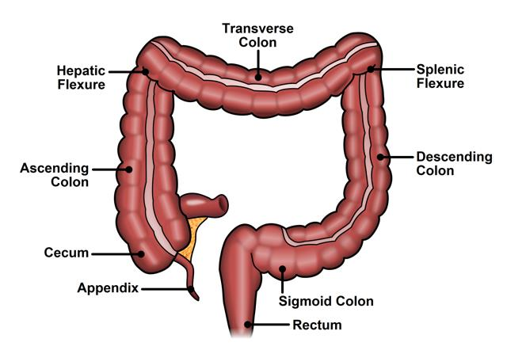

# Colon:
- It's the *longest part of the large intestine* approximately *1.5 meters* (5 feet) long and plays a vital role in the digestive system.
- Also known as Large intestine, is the final part of digestive system.
- It is responsible for *absorbing water and nutrients from digested food material* and forming stool. The colon hosts a large population of microorganisms that aid digestion and &produce essential vitamins like vitamin K and some B vitamins* which are absorbed into the bloodstream.
- It extends from the *ileocecal junction* (where the small intestine ends) to the *rectum*
## Development of Colon
- After fertilization a *zygote* is formed. By *3–4 days* it becomes a *morula* and by *5–6 days* a *blastocyst* develops.
- The blastocyst has two layers:
    - *Outer cell mass (trophoblast)*. It's developed into the *placenta*.
    - *Inner cell mass* it forms the *embryo*.
- During the *third week* *gastrulation* occurs.
- It forms *three germ layers*:
    - *Ectoderm* forms nervous system, skin.
    - *Mesoderm* forms muscles, connective tissue.
    - *Endoderm* forms epithelial lining of the gut.
- By *week 4* the *primitive gut tube* forms and dividing into *foregut, midgut, and hindgut*.
    - *Colon** arises from Midgut and Hindgut.
    - *Midgut* forms ascending colon, proximal two-thirds of transverse colon
    - *Hindgut* forms distal one-third of transverse colon, descending colon, sigmoid colon, rectum
- Between *weeks 5–10* the colon develops its *epithelial lining, muscular layers, and vasculature*.
  
## Parts of Colon
- 1.Ascending colon
- 2.Transverse colon 
- 3.Descending colon 
- 4.Sigmoid colon

## Muscle and anatomical attachments of the Colon 
**1.Ascending Colon**
  - Located on the *right side of the abdomen*. Extends upward from the cecum (a pouch connected to the small intestine). *Absorbs remaining water and nutrients* from digested food. 
  - It is retroperitoneaal (partly covered by peritoneum on its front and sides).
  - *Anterior relations*: Coils of the small intestine.
  - *Posterior attachment*: To the posterior abdominal wall by connective tissue (no mesentery).
  - Muscles behind: Right quadratus lumborum and iliacus.
    
**2.Transverse Colon**
  - *Runs across the upper abdomen from right to left*. Connected to the stomach above and the small intestine below.
  - Plays a major role in *fermentation of undigested materials by gut bacteria*. The most mobile part of the colon. 
  - Attached to the posterior abdominal wall by the transverse mesocolon (a double layer of peritoneum).
  - Suspended between the hepatic flexure and splenic flexure.
  - *Anterior relation*: Greater omentum and Anterior abdominal wall.
  - *Posterior relation*: Pancreas and duodenum.
    
**3.Descending Colon**
  - Lies on the *left side of the posterior abdominal wall*.
  - Stores fecal material that will eventually move to the sigmoid colon.
  - Retroperitoneal like the ascending colon.
  - *Anterior relation*: Small intestine loops.
  - *Posterior attachment*: To the posterior abdominal wall.
  - Muscles behind: Left quadratus lumborum.
    
**4.Sigmoid Colon**
 - Lies in the *left lower abdomen and pelvis*.
 - Intraperitoneal — Completely covered by peritoneum.
 - Attached to the posterior pelvic wall by the sigmoid mesocolon (V-shaped fold).
 - This attachment allows mobility for fecal storage and evacuation.
   
## Muscle Layers of Colon
The colon wall has *three main layers*:
- **Mucosa** – Inner lining and it is the site of most cancers.
- **Muscularis propria** – Smooth muscle layer. It has *circular and longitudinal layers* for peristalsis movement.
- **Serosa / adventitia** – Outer connective tissue layer.

*Clinical relevance:* Depth of tumor invasion into the muscularis propria determines *tumor staging* in colon cancer.

## Vascular Supply of Colon

 **1.Arterial supply**:
   
   -**1.Superior Mesenteric Artery (SMA)**
    
   -**Ileocolic artery**: Supplies the cecum, appendix, and part of the ascending colon. 
       
   -**Right colic artery**: Supplies the ascending colon and right colic flexure.
       
   -**Middle colic artery**: Supplies the transverse colon.
      
  **2.Inferior Mesenteric Artery (IMA)**
  
   -**Left colic artery**: Supplies the descending colon and left colic flexure.
    
   -**Sigmoid arteries**: Supply the sigmoid colon.
    
   -**Superior rectal artery**: Supplies the upper rectum. 
      
**Venous drainage**:

  **1.Superior Mesenteric Vein (SMV)**
  
   -**Right colic vein**: Supplies ascending colon.
      
   -**Middle colic vein**: Supplies transverse colon.
      
 **2.Inferior Messentric Vein (IMV)**
 
   -**Left colic vein**: Supplies desending colon.
      
   -**Sigmoid vein**: Supplies sigmoid colon.

## Nerve Supply of Colon
- *Autonomic innervation* controls motility and secretion:
  - **Parasympathetic:**
     - **Vagus nerve**- Supplies the colon up to the left colic flexure.
     - **Pelvic splanchnic nerves** - Supply the colon from the left colic flexure to the rectum.​
  - **Sympathetic:**
     - **Superior mesenteric plexus**: Supplies the colon up to the left colic flexure.​
     - **Inferior mesenteric plexus**: Supplies the colon from the left colic flexure onward.

*Clinical relevance*: Tumor invasion into nerves may affect motility and causes pain or contribute to cancer spread.

  
