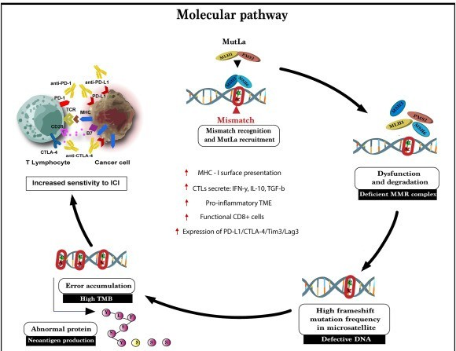

# Colon Cancer
## Introduction
 - Colon cancer, also known as *colorectal cancer* begins in the lining of the large intestine (colon) or rectum.  
 - It usually develops slowly over several years and starting as small benign growths called *polyps*.  
 - As genetic mutations build up within a polyp they causes disturbances in the normal regulation of the cell cycle and apoptosis. This leads to uncontrolled cell proliferation eventually resulting in the formation of a malignant tumor.
 - Colon cancer develops through a series of well-defined molecular pathways primarily involving genetic and epigenetic changes that lead to the transformation of normal colon cells into malignant tumors.​
   
## Causes and Risk Factors
 Several factors can increase the risk of colon cancer:
- **Genetic factors:** Inherited mutations in genes such as *APC, MLH1, MSH2, MSH6, PMS2, TP53*  
- **Lifestyle factors:** Low-fiber diet, high red meat intake, smoking, alcohol consumption  
- **Inflammatory conditions:** Ulcerative colitis and Crohn’s disease  
- **Age:** Common after 50 years  
- **Family history:** Close relatives with colon or rectal cancer

## Cancer staging (TNM and Stage classification)
 Colon cancer is classified based on *tumor invasion (T), Lymph node involvement (N), Metastasis (M)*
  - *Stage 0 (Carcinoma in situ)* : Abnormal cells confined to the mucosa, No invasion of the tumor.
  - *Stage I* : Tumor invades submucosa or muscular layer. No lymph nodes or distant spread 
  - *Stage II* : Tumor penetrates through the wall of the colon. May involve nearby tissues. No lymph nodes involvement.
  - *Stage III* : Cancer spreads to nearby lymph nodes. No distant metastasis.
  - *Stage IV* : Distant metastasis (commonly liver, lungs, peritoneum). cancer advanced stage.

## Colon morphological changes 
 Colon cancer progresses through a series of *histological changes*:
  - *Normal Epithelium* : Healthy mucosal cells  
  - *Hyperproliferation* : Rapid cell division due to early mutations  
  - *Adenomatous Polyp* : Benign tumor formation  
  - *Carcinoma in situ* : Precancerous changes  
  - *Invasive Carcinoma* : Cancer spreads beyond the mucosa into deeper tissues

## Main pathways in Colon cancer
 **1. Chromosomal Instability (CIN) Pathway**
   - This is the most common pathway (65–70%) of sporadic colon cancers. 
   - It begins with mutations in the *APC gene* which leads to abnormal activation of the *Wnt signaling pathway* and uncontrolled cell proliferation. 
   - Subsequent mutations in KRAS and TP53 further drive tumor progression and malignancy.​
     
 **2. Microsatellite Instability (MSI) Pathway**
   - This pathway is characterized by defects in *DNA mismatch repair genes (such as MLH1, MSH2, MSH6, PMS2)*.
   - It's leading to a high mutation rate and rapid progression to cancer.
   - MSI is often seen in hereditary forms of colon cancer such as Lynch syndrome.
     
 **3. ​CpG Island Methylator Phenotype (CIMP) Pathway (Serrated Pathway)**
   - This pathway involves epigenetic changes particularly hypermethylation of CpG islands, which silences tumor suppressor genes and DNA repair genes.
   - It is associated with BRAF mutations and is common in right-sided colon cancers.​

## Molecular Basis (Adenoma–Carcinoma Sequence)
 - Colon cancer develops through a series of genetic and epigenetic alterations affecting key genes that regulate cell growth, DNA repair, and apoptosis. 
 - These molecular changes follow distinct biological pathways, each involving specific mutations and mechanisms. 
 - Understanding these pathways at the molecular level is essential to comprehend how normal colon cells transform into cancer cells step by step.
 - The *Adenoma–Carcinoma Sequence* explains the stepwise accumulation of mutations that lead to colon cancer:
### 1.Chromosomal Instability (CIN) Pathway:

**1.Normal Epithelium**
   - Normal cells maintain controlled growth through balanced signaling.
     
**2.APC Gene Mutation**
   - Early mutation in **APC (Adenomatous Polyposis Coli)** gene activates the **Wnt/β-catenin signaling pathway** leading to uncontrolled proliferation.
     
**3.KRAS Mutation**
   - **KRAS oncogene** mutation activates **MAPK** and **PI3K/AKT** pathways, promoting growth and survival of adenomatous polyps.
     
**4.TP53 and SMAD4 Inactivation**
   - Loss of **tumor suppressor genes** (*TP53*, *SMAD4*) leads to loss of cell cycle control and malignant transformation.
     
**5.MMR Pathway Defects (Microsatellite Instability)**
   - Mutations in DNA mismatch repair genes (*MLH1, MSH2, MSH6, PMS2*) cause **microsatellite instability (MSI)**, characteristic of **Lynch Syndrome**.

  
   

### 2.Microsatellite Instability (MSI) Pathway

**1.Normal Epithelium**
  - Cells maintain DNA mismatch repair (MMR) function, preserving genetic stability.

**2.MMR Gene Mutation or Silencing**
  - *Mutation or epigenetic silencing (e.g., MLH1 promoter methylation) of MMR genes (MLH1, MSH2, MSH6, PMS2) occurs*.
  - DNA mismatch repair defects lead to accumulation of errors, especially in repetitive microsatellite regions.

**3.Microsatellite Instability (MSI)**
  - High frequency of mutations in microsatellite DNA sequences, leading to a *mutator phenotype*.
  - Causes widespread genetic changes, including in key growth regulatory genes.

**4.Tumor Development**
  - Rapid progression to malignancy due to defective DNA repair and accumulated mutations.
  - Tumors often display high mutation burden and distinct histologic features.

  
   

### 3.CpG Island Methylator Phenotype (CIMP) Pathway (Serrated Pathway)

**1.Normal Epithelium**

**2.Epigenetic Alterations**
  - Extensive *CpG island hypermethylation silences tumor suppressor genes and DNA repair genes*.
  - Commonly silences *MLH1 causing MSI* in some cases.

**3.BRAF Mutation**
  - Oncogenic mutations in BRAF gene frequently occur.
  - Drives *abnormal cell proliferation*.

**4.Serrated Polyp Formation**
  - Tumor grows from *serrated (saw-toothed) polyps*, distinct from traditional adenomas.

**5.Tumor Progression**
  - Accumulation of epigenetic and genetic changes leads to carcinoma.
  - Overlaps with MSI characteristics if MLH1 is methylated.

